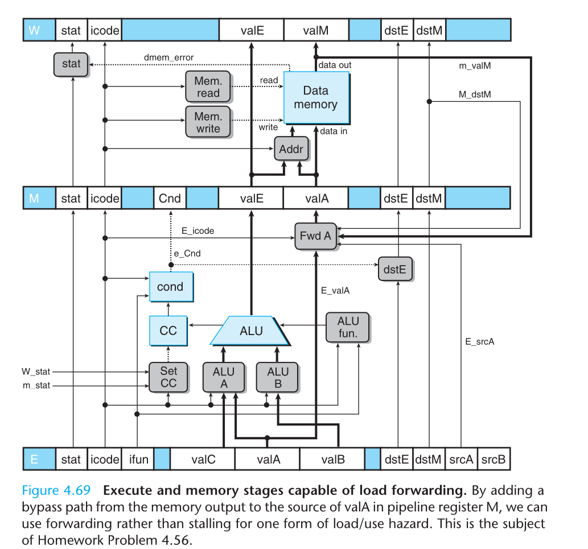

Exercise 4.56
==============

### ***Dificulty***: :star: :star: :star:

---

### ***Expected time***: ***2h*** :hourglass_flowing_sand:

---

### ***Question***:
In our design of PIPE, we generate a stall whenever one instruction performs a load, reading a value from memory into a register, and the next instruction has this register as a source operand. When the source gets used in the execute stage, this stalling is the only way to avoid a hazard.  
&emsp;For cases where the second instruction stores the source operand to memory, such as with an rmmovl or pushl instruction, this stalling is not necessary. Consider the following code examples:  

```
1   mrmovl 0(%ecx), %edx    # Load 1
2   pushl %edx              # Store 1
3   nop
4   popl %edx               # Load 2
5   rmmovl %eax, 0(%edx)    # Store 2
```  

&emsp;In lines 1 and 2, the mrmovl instruction reads a value from memory into %edx, and the pushl instruction then pushes this value onto the stack. Our design for PIPE would stall the pushl instruction to avoid a load/use hazard. Observe, however, that the value of %edx is not required by the pushl instruction until it reaches the memory stage. We can add an additional bypass path, as diagrammed in Figure 4.69, to forward the memory output (signal m_valM) to the valA field  
  
in pipeline register M. On the next clock cycle, this forwarded value can then be written to memory. This technique is known as load forwarding.  
&emsp;Note that the second example (lines 4 and 5) in the code sequence above cannot make use of load forwarding. The value loaded by the popl instruction is used as part of the address computation by the next instruction, and this value is required in the execute stage rather than the memory stage.  
1. Write a logic formula describing the detection condition for a load/use hazard, similar to the one given in Figure 4.64, except that it will not cause a stall in cases where load forwarding can be used.
2. The file pipe-lf.hcl contains a modified version of the control logic for PIPE. It contains the definition of a signal e_valA to implement the block labeled “Fwd A” in Figure 4.69. It also has the conditions for a load/use hazard in the pipeline control logic set to zero, and so the pipeline control logic will not detect any forms of load/use hazards. Modify this HCL description to implement load forwarding. See the lab material for directions on how to generate a simulator for your solution and how to test it.

---  

### ***Answear***:  
1. 
```
# Condition to load/use hazard with load forwading
hazard = (
    # Load/use hazard classic: next instruction uses the mrmovl destiny as source
    (E_icode == IMRMOVL && E_dstM != RNONE) &&
    (E_dstM == d_srcA || E_dstM == d_srcB) &&

    # Load forwarding not aplicable when the value is necessary on stage E
    !((D_icode == IRMMOVL || D_icode == IPUSHL) && E_dstM == d_srcA)
);
```  

2. [Code](./pipe-lf.hcl)


obs: used chatGPT on this one because i spent more than 2h and an hiatus so was kinda hard remember everything.