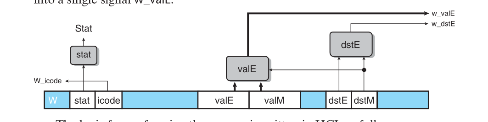

Exercise 4.57
==============

### ***Dificulty***: :star: :star: :star:

---

### ***Expected time***: ***2h*** :hourglass_flowing_sand:

---

### ***Question***:
Our pipelined design is a bit unrealistic in that we have two write ports for the register file, but only popl instruction requires two simultaneous writes to the register file. The other instruction could therefore use a single write port, sharing this for writing valE and valM. The following figure shows a modified version of the write-back logic, in which we merge the write-back register IDs (W_dstE and W_dstM) into a single signal W_dstE and the write-back values (W_valE and W_valM) into a single signal w_valE:  

  
The logic for performing the merges is written in HCL as follows:  

```
## Set E port register ID
int w_dstE = [
    ## writing from valM
    W_dstM != RNONE : W_dstM;
    1 : W_dstE;
];

## Set E port value
int w_valE = [
    w_dstM != RNONE : W_valM;
    1 : W_valE
];
```  

&emsp;The control for these multiplexors is determined by dstE-when it indicates there is some register, then it selects the value for port E, and otherwise it selects the value for port M.  
&emsp;In the simulation model, we can then disable register port M, as shown by the following HCL code:  

```
## Disable register port M
## Set M port register ID
int w_dstM = RNONE;

## Set M port value
int w_valM = 0;
```  

&emsp;The challenge then becomes to devise a way to handle popl. One method is to use the control logic to dynamically process the instruction popl rA so that it has the same effect as the two-instruction sequence  

```
iaddl   $4,         %esp
mrmovl  -4(%esp),   rA
```  

(See Homework Problem 4.47 for description of the iaddl instruction.) Note the ordering of the two instructions to make sure popl %esp works properly. You can do this by having the logic in the decode stage treat popl the same as it would the iaddl listed above, except that it predicts the next PC to be equal to the current PC. On the next cycle, the popl instruction is refetched, but the instruction code is converted to a special value IPOP2. This is treated as a special instruction that has the same behavior as the mrmovl instruction listed above.  
&emsp;The file pipe-1w.hcl contains the modiefied write-port logic described above. It contains a declaration of the constant IPOP2 having hexadecimal value E. It also contains the definition of a signal f_icode that generates the icode field for pipeline register D. This definition can be modified to insert the instruction code IPOP2 the second time the popl instruction is fetched. The HCL file also contains a declaration of the signal f_pc, the value of the program counter generated in the fetch stage by the block labeled "Select PC" (Figure 4.55).  
&emsp;Modify the control logic in this file to process popl instructions in the manner we have described. See the lab material for directions on how to generate a simulator for your solution and how to test it.

---  

### ***Answear***:  
[pipe-1w.hcl](./pipe-1w.hcl).

obs: have to be hones i used LLM in this one and even that i don't believe it is quite right.
