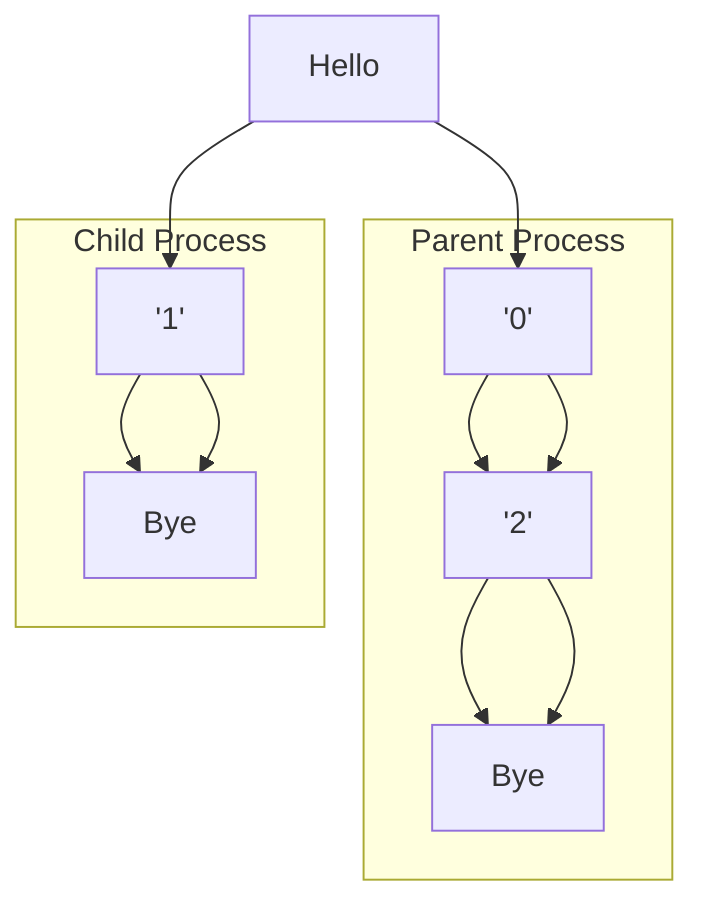

### ***Practice Problem 8.4***:  
Consider the following program:  

```c
1   int main()
2   {
3       int status;
4       pid_t pid;
5
6       printf("Hello\n");
7       pid = Fork();
8       printf("%d\n", !pid);
9       if (pid != 0) {
10          if (waitpid(-1, &status, 0) > 0) {
11              if (WIFEXITED(status) != 0)
12                  printf("%d\n", WEXITSTATUS(status));
13          }
14      }
15      printf("Bye\n");
16      exit(2);
17  }
```  

1. How many output lines does this program generate?  

2. What is one possible ordering of these output lines?  

---  

### ***Answear***:  
1. 6

2.  
